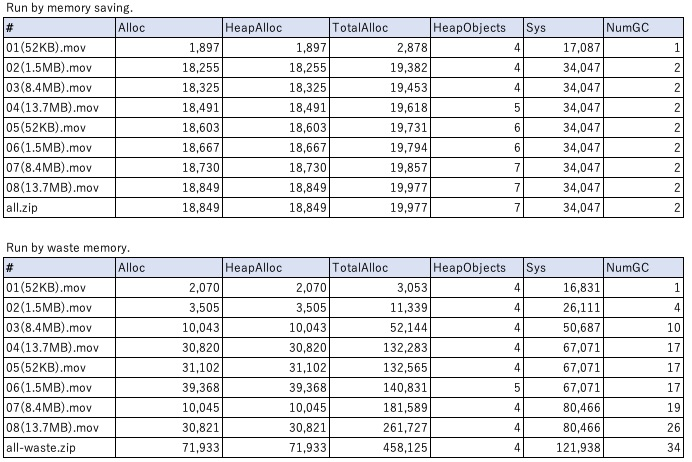
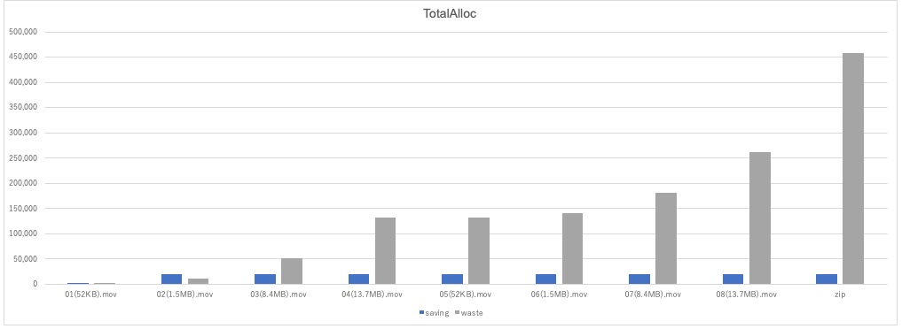
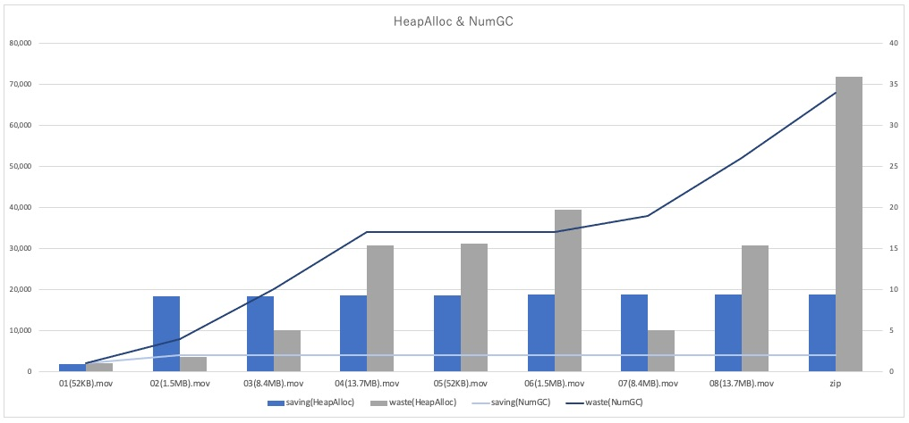

# zip-test2
golang test code that create zip file by using GCS streaming.

## Overview



## Usage

### Start GCS Emulator
```
make up
```

### Run memory saving
```
make run
```

### Run waste memory
```
make runw
````

### Stop GCS Emulator
```
make down
```

## Investigation



